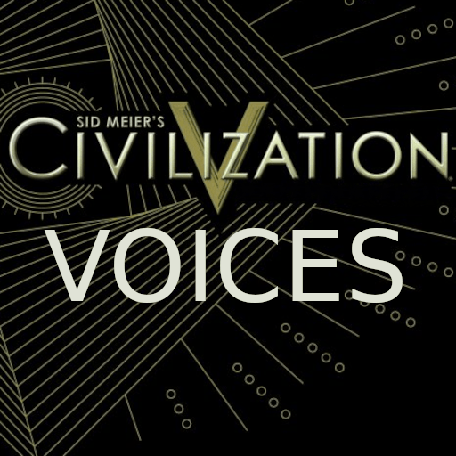

# Civ V Sounds for Unciv

Provides some of Civ V's quotes in [Unciv](https://github.com/yairm210/Unciv).

## Features

- Technology Quotes
- Wonder Quotes
- Create an issue to request more

## See Also

- [Civ V Music Pack](https://github.com/Kurwizimi/Civ-V-Music-Pack)

## Installation

1. Open Unciv
2. Open the Mods menu
3. Click Sort and Filter
4. Search for "Civ V Sounds"
5. Download and install
6. Enable "Permanent audiovisual mod"

## Development

### Sources

- SteamLibrary/steamapps/common/Sid Meier's Civilization V/steamassets/assets/sounds/speech/english
- SteamLibrary/steamapps/common/Sid Meier's Civilization V/steamassets/assets/dlc/expansion/sounds/speech/english
- SteamLibrary/steamapps/common/Sid Meier's Civilization V/steamassets/assets/dlc/expansion2/sounds/speech/english

### Naming

- Wonders `WonderName - Wonder.mp3`
- Technologies `TechName - Researched.mp3`
- Voices
  - `assets/sounds/speech/shared/elizabeth`
  - `intro.mp3` > `Nation.introduction.mp3`
  - `defeated.mp3` > `Nation.defeated.mp3`
  - `attacked.mp3` > `Nation.attacked.mp3`
  - `neutralhello.mp3` > `Nation.neutralHello.mp3`
  - `hatehello.mp3` > `Nation.hateHello.mp3`
  - `request.mp3` > `Nation.tradeRequest.mp3`
  - `declarewar.mp3` > `Nation.declaringWar.mp3`
